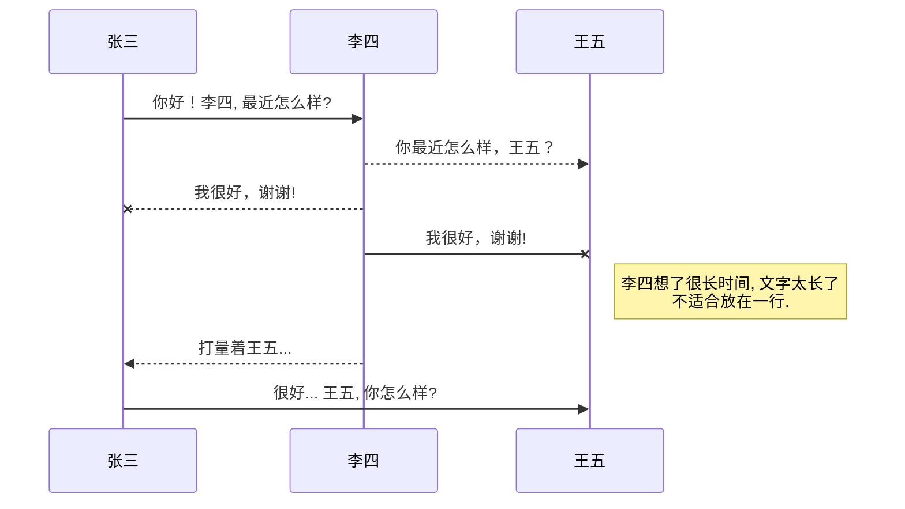
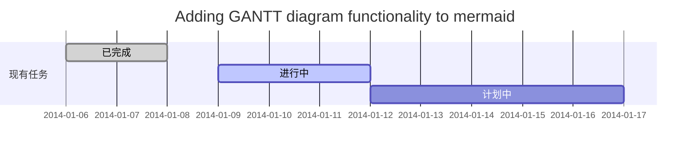
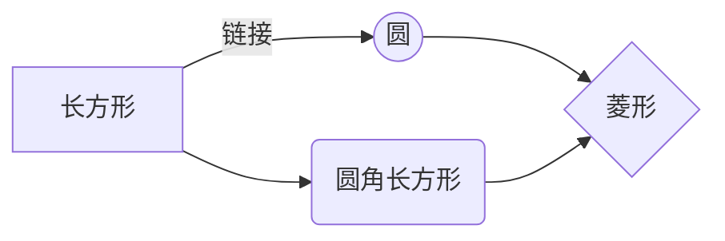
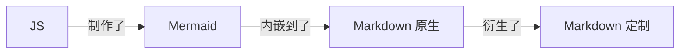
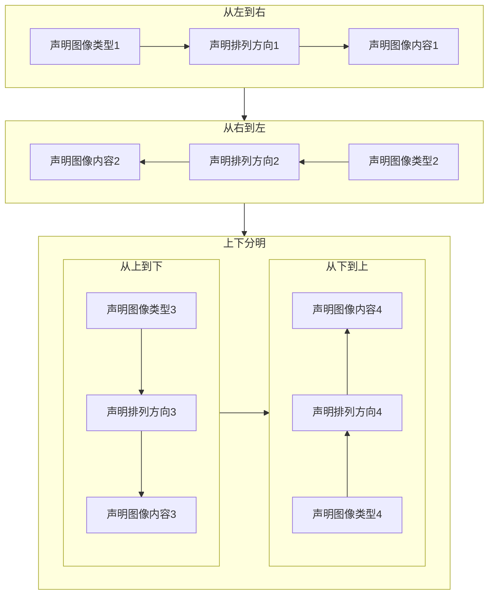

### UML 图



---

### 甘特图


---

###  flow 流程图

```mermaid
    lowchat
        st=>start: 开始
        e=>end: 结束
        op=>operation: 我的操作
        cond=>condition: 确认？

        st->op->cond
        cond(yes)->e
        cond(no)->op
```

---

### Mermaid 类图



---


---
#### 流程图




